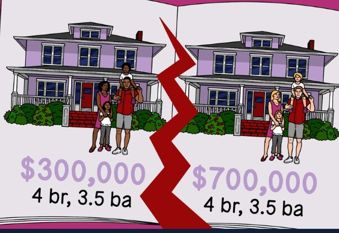

# louisville_real_estate

## Datasets
Owned homes data by zip code: https://www.realtor.com/research/data/  
A csv created by Realtor.com (a website similar to Zillow where you can search for homes and rentals) that provides housing data by zip code. This dataset is reflective of data as of 09/2022.  
Rental data by zip code: https://www.zillow.com/research/data/  
A csv created by Zillow.com (a website where you can search for homes and rental) that provides rental data by zip code. This dataset is reflective of data as of 9/30/2022.
Mortgage calculator equation: https://www.mymove.com/mortgage/mortgage-calculation/  
An article that breaks down how mortgages are calculated. I used this to guide how I built the mortgage calculator.

## Intro
In the real estate industry, there are several ways you can choose to invest. I have an interest in using real estate to build wealth, so my project features calculators, visuals, and analysis to support real estate research efforts relevant to becoming a landlord. When researching where you want to invest, of course one of the main data points you want to analyze is the potential for profit. This is what guided my project. Also, I am interested in investing in Louisville, KY, so all data & visualizations are reflective of only Louisville. Below is a list of features & descriptions of them:

###### Calculators:
- Mortgage: after the user inputs a zip code, the mortgage calculator calculates the estimate mortgage payment based on the average house listing price in that zip code. 
- Profit: allows you to input a particular zip code and it will return a few data points relevant to the zip code input: average monthly rental price, average listing price, and the estimated profit you would make if you were to become a landlordin that zip code based on the average monthly rental price & average house listing price 

## Instructions
You can run the files in any order. Below is a guide to how you should run each file:
1. analysis.py - gives a few datapoints that expose the major wealth gap in Louisville, KY, which is evident in pretty much any large city.
    1. Run the program (ctrl + f5).  
    2. The program will return various data points about where the most expensive and least expensive places to live and invest in are located in Louisville, KY.  

2. profit_calculator.py - description is above in the Intro/Calculators section
    1. Run the program (ctrl + f5).  
    2. Enter a zip code that is within the bounds of Louisville, KY (i.e., 40206).  
    3. The program will return various data points to help you begin to understand if this area is a good area to invest in from the perspective of a potential landlord.  

3. visuals.py
    1. Run the program (ctrl + f5)   
    2. A pie chart will pop up that shows how the average housing price in each zip code compares to the others in the grand scheme of the Louisville housing market.  
    3. Enter a zip code that is within the bounds of Louisville, KY (i.e., 40206).  
    4. The program will return a line chart that shows a trendline of mortgage prices from 09/2019 to 09/2022.  

## Analysis 
Part of what sparked my interest in analyzing real estate data in Louisville was of course wanting to invest in property. Another part of real estate data that piques my interest is learning about wealth gaps and how we as civilians can work to narrow them. The results of the analysis.py file show that there is a difference in the highest and lowest housing prices of almost 5000%. Of course, this dataset included some outliers that tremendously skew both the highest and largest housing prices. Even after taking the average housing price of all zip codes, there is still a 1231% difference between the average housing price of all houses in Louisville and the lowest housing price.  
Since I have been working with data in Louisville over the past year or so, I have come across some redlining data that further exposes the wealth gap in Louisville, espeically related to home ownership. Because houses appreciate and they are of high cost, home ownership is a large indication of wealth not only individually, but also within a community/neighborhood. When looking at the analysis.py file, the highest housing and rental prices are in east end zip codes, while the lowest are in west end zip codes. In Louisville, the east consists of suburban neighborhoods and the west is an urban area. When redlining came to be in Louisville, the same exact houses in the east end of Louisville were prices several times higher than the ones in the west end. This is still true if we look at data comparing neighborhoods like the Highlands and Russell. The lasting effects of redlining are still evident almost a century later.

## Features
1. Read in data (in all .py files)
- rental data from Zillow.com
- housing data from Realtor.com
2. Manipulate & clean data
- filtered for Louisville, KY in all .py files
- had to cast data in profit_calculator for python to be able to interpret data types
3. Analyze data
- mortgage calculator (profit_calculator.py file)
- profit calculator (profit_calculator.py file)
- analysis.py file
4. Visualize data
- visuals.py file
5. Interpret data
- Interpretation section of README file